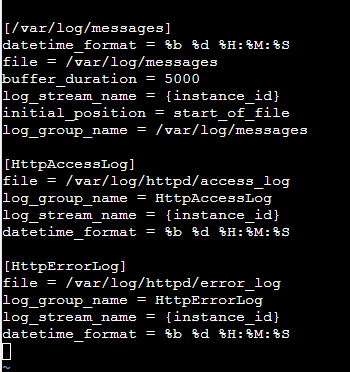
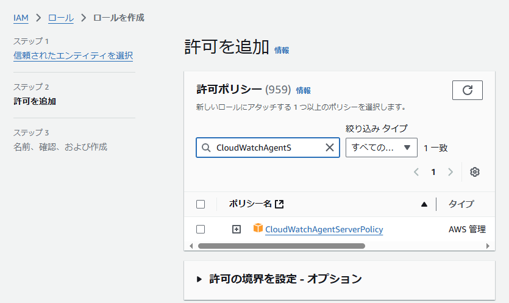
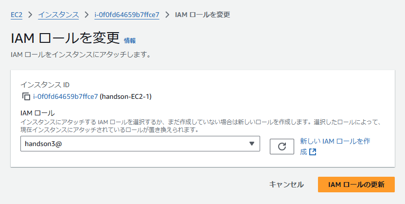
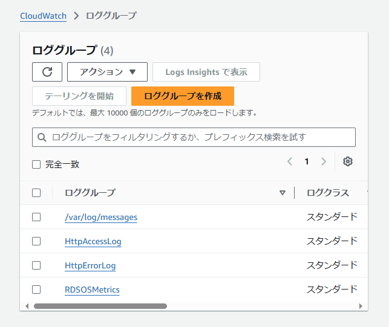
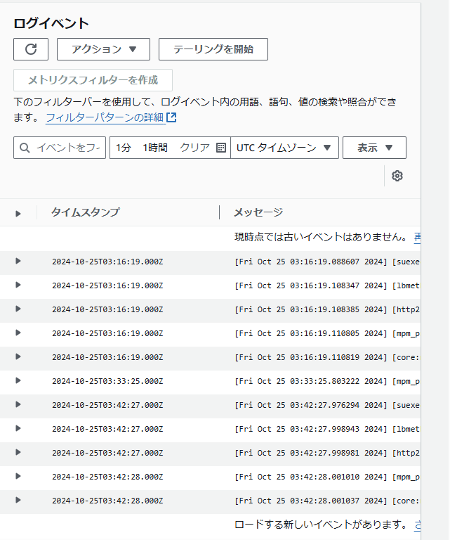

# ハンズオン03+@  
- ## Cloudでログの監視をする  
EC2にインストールされたアパッチのアクセスログをCloudWatchに送信する方法を確認する。  

- ### CloudWatcheエージェントをEC2にインストールする  
```bash:title   
$ sudo yum install awslogs  
$ cd /etc/awslogs/  
$ ll  
#表示されたファイルを編集  
$ sudo vi awscli.conf  
#リージョンを東京に変更  
$ sudo vi awslogs.conf  
```  
- ### awslogs.confに以下を追加  
```bash:title 
[HttpAccessLog]
file = /var/log/httpd/access_log
log_group_name = HttpAccessLog
log_stream_name = {instance_id}
datetime_format = %b %d %H:%M:%S

[HttpErrorLog]
file = /var/log/httpd/error_log
log_group_name = HttpErrorLog
log_stream_name = {instance_id}
datetime_format = %b %d %H:%M:%S  
```  
  

- ### EC2が再起動後に自動でawslogsdが立ち上がるように設定する  
```bash:title  
$ sudo systemctl enable awslogsd  
#EC2が再起動しても自動で立ち上がるように  
$ sudo systemctl start awslogsd  
#スタート  
$ systemctl restart awslogsd  
#リスタートすることでlogが送られるようになる  
```  

- ### EC2にIAMロールをアタッチする  
ポリシーの作成  
  
IAMロールの変更  
  
logの確認  
  

