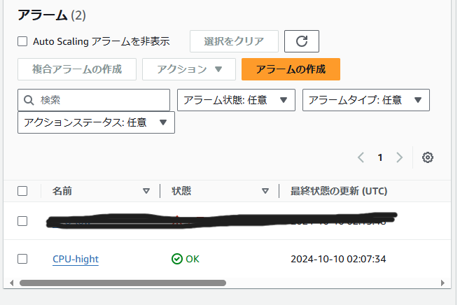
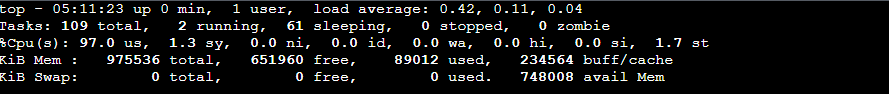

# ハンズオン03  
- スケーラビリティのあるブログサービスを構成する。   
ELBにAuto Scalingグループを紐づけてEC2を最大4最小2の範囲でスケーリングさせる。  
Auto Scaling全体のCPU使用率（70％以上）を監視するアラームを紐づけて、EC2に負荷をかけスケーリングすることを確認する。  

構成図  

 

- 起動テンプレートの作成  
前回作成したEC2を起動し、EC2からテンプレートを作成する。  
テンプレートの作成の際、マシンイメージ（AMI）は前回使用した自分のAMIを使用する。  

  

  

- auto scalingグループの作成  

  
  
  
  

- CloudWatchアラームの作成  
CPU使用率が70％以上の時に通知が登録されたメールアドレスに来るようにする。  
一度CloudWatchに関しては授業で[課題](https://github.com/shio0727/Kadaiyou/blob/main/lecture06/lecture06.md)
で取り扱っている為割愛する。  
メトリクスはEC2→AutoScalingグループ別→CPUUtilizationを選択する  

   

- スケーリングポリシーの作成  
CloudWatchアラームをスケーリングポリシーに連携する

  

- 動作確認  
SSH接続したEC2に負荷をかける。 

```bash:title  
$ yes >> /dev/null &  
```  
 

EC2が増加している事をlogで確認する。
  


