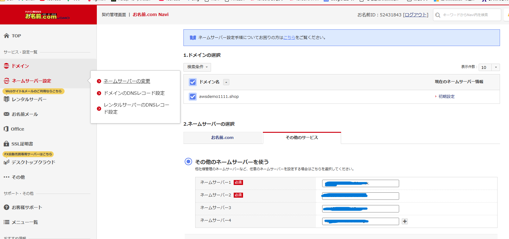

# ハンズオン04  
- ## 独自ドメインを設定する、障害時はSORRYページへ通信を流す  
他社サイトで取得したドメインのネームサーバーを書き換え、ドメインを紐づける  
フェイルオーバールーティングに設定をし直す  

- ### ドメインの取得  
[お名前ドットコム](https://www.onamae.com/server/)で無料ドメインを取得する  

- ### Route 53 ホストゾーンの作成  
  
  
  
- ### ネームサーバーの変更(お名前ドットコムでの操作)  
Route 53 で発行したネームサーバーを使用する。  
  
- ### 取得したドメインでアクセスできるように設定する  
シンプルルーティングを選択し、Route 53でレコードを作っていく
  
- ### フェイルオーバールーティングの設定を行う。  
S3バケットを製作する（名前をドメインの名前と揃える必要がある）  
  
ブロックパブリックアクセスを無効にする  
  
画像とhtmlファイルをS3バケットの中に入れる
  
S3のプロパティの一番下にある静的ウェブサイトホスティングを編集  
  
  
アクセス許可のメニューからバケットポリシーを設定する  
  
先ほどシンプルルーティングで設定したレコードをフェイルオーバールーティングに変え、プライマリを選択する。  
セカンダリのものも作成する。  
  
  
 
